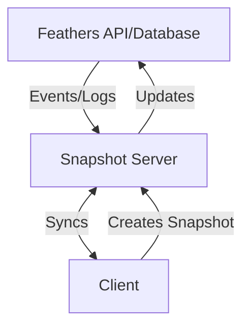

# Feathers Offline Synchronization

## Example

This repository contains an example for a Feathers API with full offline-first capabilities. It comes in several components:

### Installation

Install all the dependencies in the monorepo with

```sh
yarn install
```

### Running the example

First, run basic initialization:

```sh
yarn run init
```

With Docker running, the development system can be started like this

```sh
yarn run dev
```

Then go to [http://localhost:5173](http://localhost:5173). The API server is running at [http://localhost:3030](http://localhost:3030).

To run another server to test server to server synchronization in a new terminal run:

```sh
yarn run s2s
```

It will be available at [http://localhost:5050](http://localhost:5050).

## Goal

The goal of this project is to add full offline-first capabilities to a Feathers API.

## Automerge Snapshots

In order to flexibly add offline capabilities we are proposing the following structure:



## Alternatives

Several local-first synchronization options were evaluated, however, most rely on (Postgre)SQL or paid infrastructure.


## Limitations

- Soft delete
- Run hooks (keep separate snapshot of server "view" and client changes)
