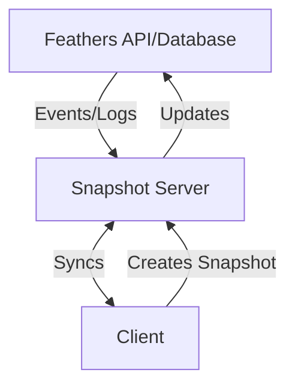

# Feathers Offline Synchronization

## Example

This repository contains an example for a Feathers API with full offline-first capabilities. It comes in several components:

### Installation

Install all the dependencies in the monorepo with

```
npm install
```

### MongoDB

Start the local MongoDB server with

```
docker compose up
```

### server

This is a standard Feathers 5 API with websockets enabled and a `todos` service as well as a `sync` service which stores information about the synced documents (e.g. Automerge document IDs, service path and channel).

Run it with

```
cd server
npm run dev
```

### sync-server

This is the synchronization server that connects to the `server` API and handles the synchronization of the documents.

Run it with

```
cd sync-server
npm start
```

On first start it will initialise an Automerge document for the `todos` service on the default channel.

### frontend

The frontend is a simple Todo app using VueJS and a Feathers client with websockets enabled and a `todos` service.

Run it with:

```sh
cd frontend
npm run dev
```

Then go to [localhost:5173](http://localhost:5173).

## Goal

The goal of this project is to add full offline-first capabilities to a Feathers API.

## Automerge Snapshots

In order to flexibly add offline capabilities we are proposing the following structure:



## Alternatives

Several local-first synchronization options were evaluated, however, most rely on (Postgre)SQL or paid infrastructure.


## Limitations

- Soft delete
- Run hooks (keep separate snapshot of server "view" and client changes)
