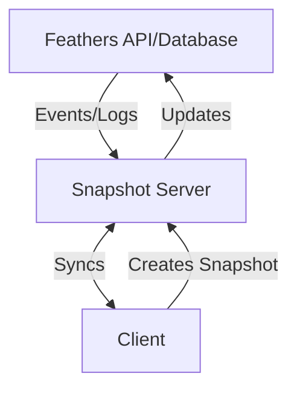

# Feathers Offline Synchronization

## Goal

The goal of this project is to add full offline-first capabilities to a Feathers API.

## Automerge Snapshots

In order to flexibly add offline capabilities we are proposing the following structure:

### Snapshot Server

The key component for synchronization is a _snapshot server_. It is used to create offline views (normally based on a query) that can be freely edited while offline and are synchronized once the client is back online. The snapshots server then determines the changes that need to be made to either the Feathers API or to the database directly. The snapshot server also keeps tracks of events from the Feathers API (or the database change feed) to keep current snapshots up to date.

### Client

A client creates a snapshot document, usually based on a query, e.g. `service.find({ query: { userId, projectId } })`. This will then become available offline and can be viewed and modified (changing existing entries and adding new ones).

### Sync Server

This is a basic [Automerge Sync Server](https://automerge.org/) that synchronizes the snapshot documents between clients and the snapshot server. It can run within the Snapshot server.

## Alternatives

Several local-first synchronization options were evaluated, however, most rely on (Postgre)SQL or paid infrastructure.

## Limitations

- Soft delete
- Run hooks (keep separate snapshot of server "view" and client changes)
